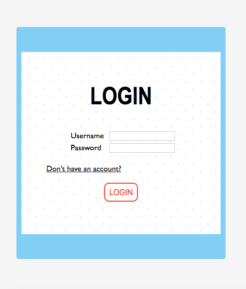
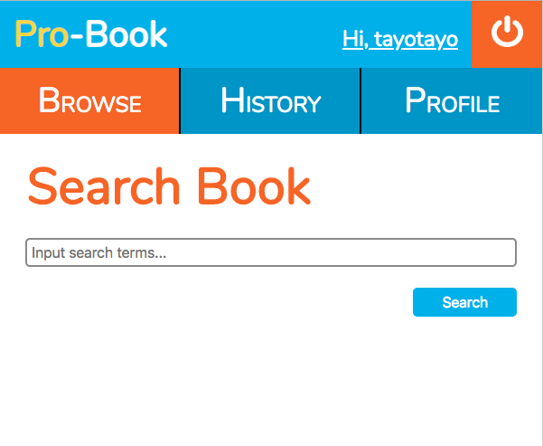
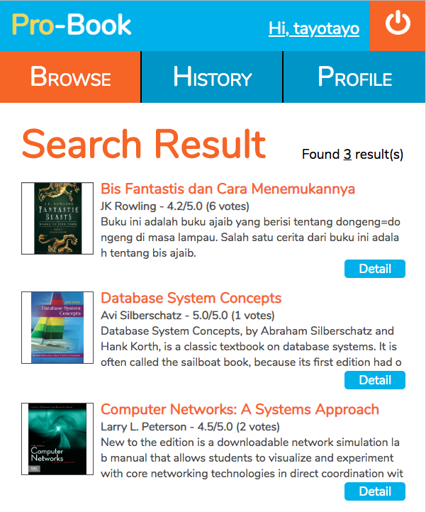
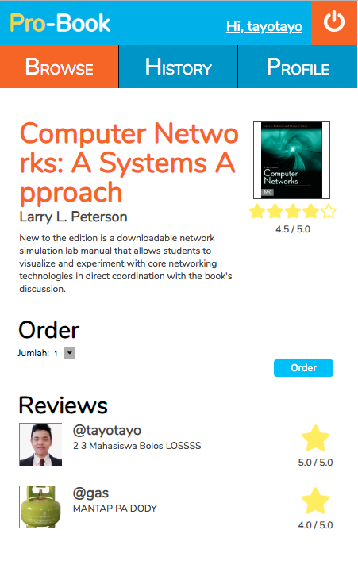
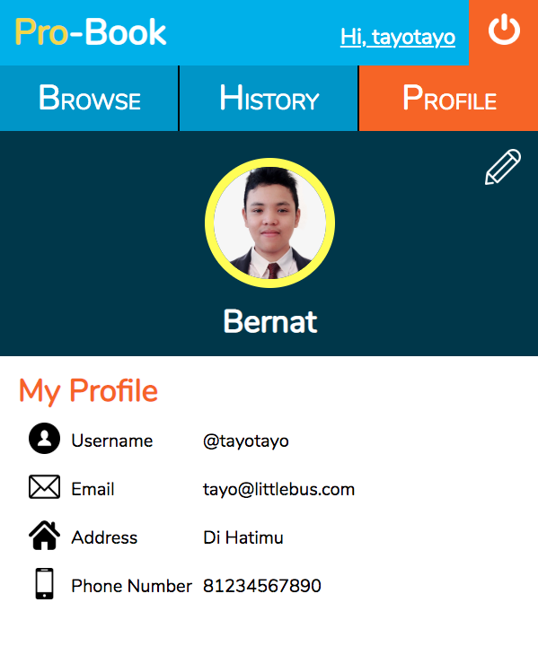
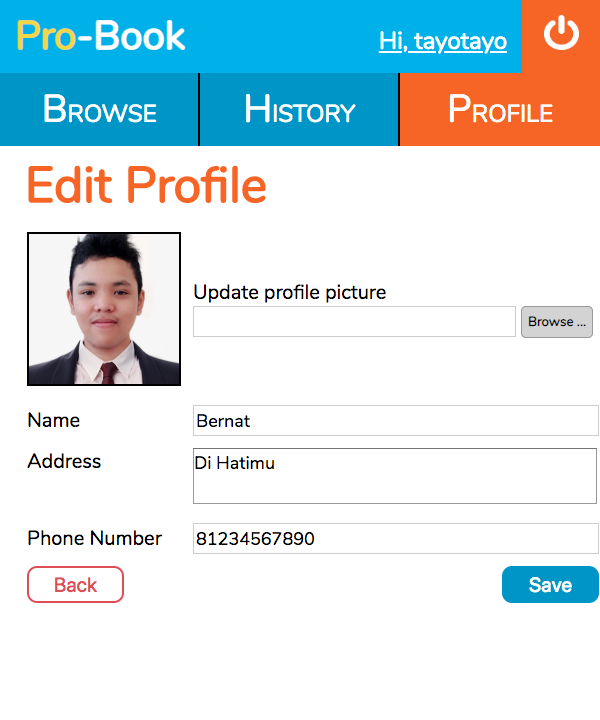
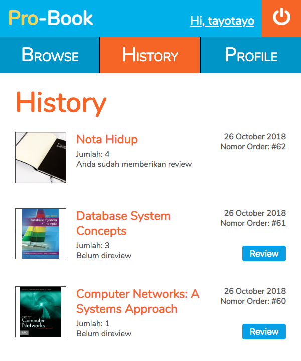
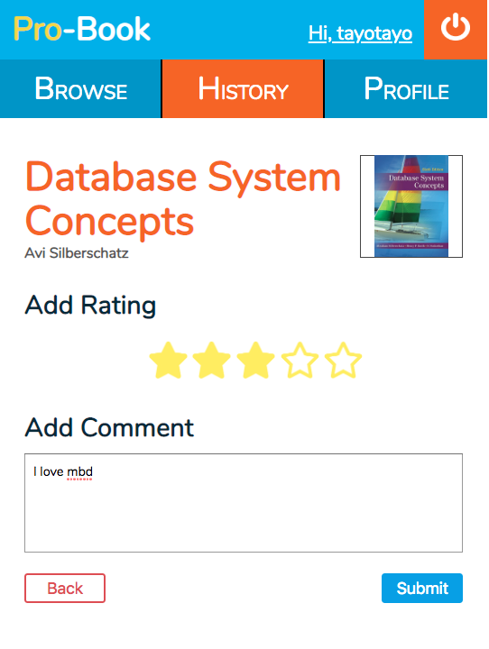

# Tugas 1 IF3110 Pengembangan Aplikasi Berbasis Web

## Tampilan Aplikasi dan Dokumentasi

### Login

Pengguna dapat login dengan username dan password yang sudah didaftarkan sebelumnya. Login hanya membandingkan username dan password yang sudah disimpan di database, disimpan dalam parameter HTTP POST. Username yang sudah login akan disimpan sebagai cookie dalam browser. Saat login akan terbentuk sebuah akses token yang disimpan dalam cookie. Lalu akses token diconcat dengan username untuk menghasilkan id yang disimpan di cookie. Di setiap laman, untuk mengecek apakah user sudah login, cookie username diconcat dengan cookie access token lalu dibandingkan dengan cookie id. Jika ketiga cookie tersebut tidak ada, maka pengguna dianggap belum login dan aplikasi akan selalu mengarahkan (redirect) pengguna ke halaman ini, meskipun pengguna membuka halaman yang lain. Masa berlaku cookie username dan access token sampai laman ditutup, sedangkan masa berlaku cookie id selama 1 jam.

### Register

Pada laman ini, pengguna dapat mendaftar menjadi anggota dari situs **Pro-Books**. Pengguna harus memasukkan data berupa nama, username, email, password, alamat, dan nomor telepon. Semua *field* dalam form harus diisi, jika tidak pengguna tidak dapat mendaftar. Jika username atau email yang dimasukkan pengguna sudah terdaftar, pengguna juga tidak dapat mendaftar menjadi user. Setelah proses pendaftaran selesai, pengguna akan langsung memasuki laman **Search-Books**.

### Search-Books

Pada navigation bar terdapat tulisan **Pro-Book** *username* dan tombol *logout*. Ketika meng-*click* **Pro-Book** akan *redirect* ke laman **Search-Books**. Ketika meng-*click* **Hi, username** akan *redirect* ke laman **Profile**. Ketika meng-*click* tombol *logout* maka pengguna akan keluar dan *redirect* ke laman **Login**. Selain itu juga ada 3 menu, yaitu **Browse**, **History** dan **Profile**. Ketika meng-*click* **Browse** akan *redirect* ke laman **Search-Books**. Ketika meng-*click* **History** akan *redirect* ke laman **History**. Ketika meng-*click* **Profile** akan *redirect* ke laman **Profile**.   
Pada laman ini, dapat melakukan pencarian buku berdasarkan judul. Buku yang ditampilkan adalah buku yang memiliki judul yang merupakan *substring* dari masukan pengguna. Pengguna akan menuliskan *key word* pada *search box* lalu menekan tombol **search**. Lalu akan *redirect* ke laman **Search-Result**.

### Search-Result

Laman ini akan menampilkan hasil pencarian berdasarkan masukan pengguna pada laman **Search-Book**. Buku yang ditampilkan merupakan buku yang memiliki judul yang merupakan *substring* dari masukan pengguna sebelumnya. Setiap buku akan ditampilkan gambar, judul, penulis, *rating* dan deskripsi singkatnya. Lalu, masing-masing buku akan memiliki tombol **detail** yang akan melakukan *redirect* ke laman **Book-Detail**.

### Book-Detail

Pada halaman ini, ditampilkan detail buku yang terdiri dari judul, penulis, gambar, rating, serta komentar dan rating dari user lain.

Pada halaman ini juga disediakan dropdown untuk memasukkan jumlah buku yang ingin dipesan, berisi angka dari 1 sampai 5, dan tombol order. Jika tombol order ditekan, proses pemesanan akan dilakukan menggunakan AJAX, yang berarti halaman tidak akan di-refresh setelah tombol order ditekan.

### Profile

Pada laman ini, akan ditampilkan informasi dari pengguna yang mencakup foto profil, nama, username, email, alamat, dan nomor telepon. Jika *icon* pensil pada bagian kanan atas laman di-klik, pengguna akan memasuki laman **Edit-Profile**.

### Edit-Profile

Pada laman ini, pengguna dapat mengganti foto profil, nama, alamat, atau nomor teleponnya. Username dan email tidak dapat diganti oleh pengguna. Jika pengguna meng-klik tombol **Back**, pengguna akan kembali pada laman **Profile** tanpa terjadi perubahan, dan jika pengguna meng-klik tombol Save, perubahan yang dilakukan oleh pengguna akan disimpan dan pengguna akan memasuki laman **Profile** dengan data yang baru.

### History

Pada laman ini, pengguna dapat melihat semua order yang telah dilakukan sebelumnya, dimulai dari order yang paling baru dilakukan. Selain itu, ditampilkan juga apakah user sudah pernah me-<i>review</i> order tersebut atau belum. Jika pengguna belum me-<i>review</i> order tersebut, terdapat tombol <i>review</i> di bagian kanan order tersebut yang akan mengarahkan ke laman Review untuk order tersebut.

### Review

Pada laman ini, pengguna dapat memasukkan rating dan komentar untuk me-<i>review</i> order yang berkaitan. Rating dimasukkan dengan meng-klik salah satu bintang, sesuai dengan angka yang diinginkan. Pada bagian bawah halaman, terdapat tombol submit untuk mengirimkan review. Selain tombol submit, terdapat juga tombol back yang akan mengarahkan pengguna ke laman sebelumnya, yaitu History. Setelah submit, pengguna akan diarahkan kembali ke laman History.

## Struktur File
Aplikasi ini menyimpan file-file utama pada folder root, dan memiliki 4 folder utama. Folder tersebut adalah config, mocks, public, dan utils. 

- **config**: berisi setting konfigurasi database.
- **mocks**: berisi foto-foto tampilan mock-up dari aplikasi.
- **public**: berisi file statik dari aplikasi. Pada folder ini, terdapat 4 folder yaitu css, icons, img, dan js.
    - **css**: menyimpan file css dari setiap halaman.
    - **icons**: menyimpan icon-icon yang digunakan aplikasi.
    - **img**: menyimpan file gambar-gambar yang digunakan, termasuk untuk gambar buku dan gambar profile user.
    - **js**: menyimpan file javascript yang digunakan.
- **utils**: berisi fungsi-fungsi pembantu yang digunakan pada aplikasi.

## Pembagian Tugas

**Tampilan**
1. Login: 13516036
2. Register: 13516015
3. Search-Books: 13516078
4. Search-Result: 13516078
5. Book-Detail: 13516036
6. Profile: 13516015
7. Edit-Profile: 13516015
8. History: 13516009
9. Review: 13516009

**Fungsionalitas**
1. Login: 13516036
2. Register: 13516015
3. Search-Books: 13516078
4. Search-Result: 13516078
5. Book-Detail: 13516036
6. Profile: 13516015
7. Edit-Profile: 13516015
8. History: 13516009
9. Review: 13516009

## About

**bernat tidur**

1. Rahmat Nur Ibrahim Santosa  | 13516009
2. Michelle Eliza Gananjaya    | 13516015
3. Ilma Alifia Mahardika       | 13516036
4. Muhammad Alif Arifin        | 13516078

